# DIAGRAMY ARCHITEKTURY - Aplikacja Android Magazyn

## 1. ARCHITEKTURA APLIKACJI

## 2. PRZEPŁYW DANYCH - SYNCHRONIZACJA ZWROTÓW

## 3. PRZEPŁYW DANYCH - SKANOWANIE KODU

## 4. PRZEPŁYW DANYCH - PRZEKAZYWANIE DO HANDLOWCA

## 5. ARCHITEKTURA BAZY DANYCH - ER DIAGRAM

## 6. NAVIGATION GRAPH

## 7. STATE MANAGEMENT - ViewModel

## 8. OFFLINE SYNC STRATEGY

## 9. SECURITY ARCHITECTURE

## 10. WORK MANAGER - BACKGROUND SYNC

## 11. SCANNER FLOW - DETAILED

## 12. API ENDPOINTS - REQUEST/RESPONSE FLOW

```mermaid
sequenceDiagram
    participant App
    participant AuthInterceptor
    participant API
    participant Backend
    participant Database
    
    App->>AuthInterceptor: HTTP Request
    AuthInterceptor->>AuthInterceptor: Add Bearer Token
    AuthInterceptor->>API: Authenticated Request
    API->>Backend: Route to endpoint
    
    alt Valid Token
        Backend->>Database: Query data
        Database-->>Backend: Result
        Backend-->>API: 200 OK + Data
        API-->>App: Success Response
    else Expired Token
        Backend-->>API: 401 Unauthorized
        API->>App: Token expired
        App->>API: POST /auth/refresh
        API-->>App: New tokens
        App->>AuthInterceptor: Retry original request
    else Invalid Token
        Backend-->>API: 403 Forbidden
        API-->>App: Unauthorized
        App->>App: Navigate to Login
    end
```

## 13. DATABASE MIGRATION STRATEGY

## 14. NOTIFICATION ARCHITECTURE

## 15. ERROR HANDLING STRATEGY

---

**Koniec dokumentu diagramów**
